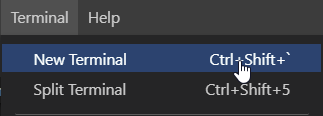
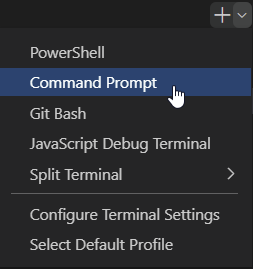
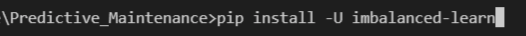
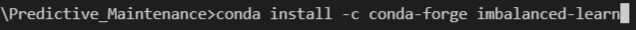

# Predictive Maintenance Business Case 

**TODO**
+ Document prerequisites and installation process

---

## Introduction
The general git repository for the case "predictive maintenance" given by Zuyd Universiry Applied Sciences. The project has a total of 4 contributors. The case is developed in [Jupyter Notebook](https://jupyter.org/). 

## Prerequisites
+ At least Python version. 3.7.2 (see [downloads](https://www.python.org/downloads/) or download 3.7.2. [directly](https://www.python.org/downloads/release/python-372/))

---

# Installations

## 1. Installation and running the source-code
+ Either [install a local version of Jupyter Notebook via Mamba, Conda or Pip](https://jupyter.org/install).

<br>

## 2. Insallation of the IMBLearn module <br>
To make use of the IMBLearn module (which is used for oversampling) it's necessary to install a module called imblearn. To do so, follow the following steps:

1. Open the ipython notebook file in vscode 
2. Select in the upper bar *Terminal > New Terminal* 
   
   

<br>

3. In the upper right corner of the terminal bar select the dropdown menu near the ```+``` sign and select *Command Prompt*
   
   

<br>

4. When executing using the Python Kernel, execute the pip install command ```pip install -U imbalanced-learn```
  
   

<br>

5. When executing using the Anaconda Kernel, execute the conda install command ```conda install -c conda-forge imbalanced-learn``` 
 
   

<br>